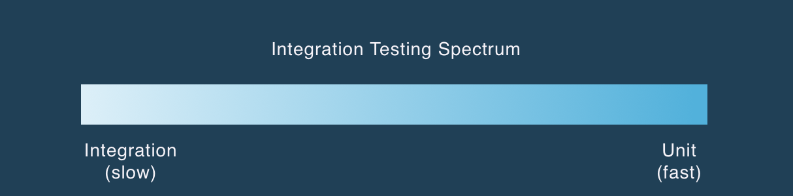
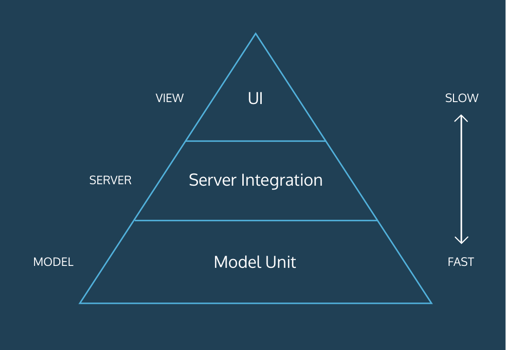

# The Testing Pyramid
## Learn about the testing pyramid

Full-stack web applications are often large and complex, and can grow to serve hundreds of different views to millions of users. As the size of a codebase and number of users grow, the cost of bugs compounds — from losing users to slowing production.

You can mitigate the frequency of costly bugs by adding a test suite to your codebase. The purpose of a test suite is to catch errors before you deploy changes to your web application. Without proper attention, however, a test suite can become bloated or ineffective. In this article, you will learn about the *testing pyramid*, a framework for designing a test suite that optimizes for speed and confidence.

By the end of this article, you will understand an approach to building test suites that optimize for both speed and confidence.

## Example
Most full-stack web applications include the following layers:
- A *view* that appears in a user’s web browser
- A *server* that handles HTTP requests
- A *database* that stores information about user interactions

Throughout this article, we will use the following example to illustrate the testing needs in each layer of a full stack web application.

*Imagine you are developing a movie blog and want to build a feature that allows users to comment on your posts. Any comment can be read by any other user on the website.*

This is how a user may interact with your web application:
- The browser renders comments below the blog post.
- When a user wants to post a comment, they enter text into a box and click the Submit button.
- Your web application transmits the comment to your server.
- Your server checks if the POST has any errors. If it does not, it creates a new comment and saves it to the web application’s database.
- The next user to arrive will see the last comment at the top of the list of comments.

In the next section, we will begin to learn about the types of tests we can run against the full-stack web application above.

## Integration Tests and Unit Tests
We call some web applications “full stack,” because we think of the view, server, and model/database as separate layers — each one sitting on top of and relying on the one below it. This structure impacts the types of tests that we can run against our web application.

Developers think of tests as fitting into a spectrum. The spectrum represents the amount of the web application that a test exercises.

Let’s consider some of the vocabularies in the spectrum above. **Unit tests**

*Unit tests* are isolated and fast tests that check one small behavior within your web application.

For example, we want to test whether our database can save a comment. Saving does not involve the view or server. We can create a test that writes directly to the database, and the test itself doesn’t need to know about the other layers.

A test like this is fast, but only gives you confidence that a small slice of your system is working as intended.

**System tests** System tests are a group of fully integrated tests that exercise your entire web application.

For example, we want to test whether our blog renders with the correct post and comments. We can write a test that checks whether a browser renders a stored blog post. This test exercises every layer of the web application:
- The database stores the blog post.
- The server sends the HTML to the browser.
- The browser renders the view.
  
A test like this is slow and less descriptive but provides you with confidence that a large slice of your system is working as intended. **Integration tests  **include everything between unit tests and system tests. They exercise multiple parts of the web application, often in different layers.

For example, an integration test may check whether your web application can save a server-generated comment to the database. This test integrates two layers of your web application:
- The server receives the comment and sends it to the database.
- The database stores your comment.

Developers often call tests like the one above end-to-end tests, because they start in the browser (one end) and traverse the stack to the database (other end).

Integration tests are faster than system tests, but slower than unit tests. They provide less confidence (that your feature works as expected) than system tests and more confidence than unit tests.

#### Shape of a testing suite
The goal of a full-stack web application’s testing suite is to provide you with confidence that your application works as expected while executing in a timely fashion.

How would you use integration and unit tests to accomplish this?
- You could write few integration tests that provide you with confidence, and more unit tests that execute quickly and provide you with specific feedback.
  
The number and types of unit and integration tests that you write can be mapped onto the *testing pyramid*.

## The Testing Pyramid
The testing pyramid is an approach to structuring your test suite.

Browser-level integration tests sit on the top of the pyramid. This layer is the narrowest because it should have the fewest number of tests — the slow nature of browser-level tests make them more expensive than server-level tests.

While server tests don’t need to interact with the browser, they usually exercise parts of the model or database. They sit close to the middle of the spectrum between unit and system tests. They provide a moderate level of confidence as they may exercise multiple layers of the stack. Server tests are more expensive and provide less specific error messages than model tests.

Compared to browser and server tests, model and database tests exercise a smaller portion of the stack. They provide the most specific feedback, but not much confidence that the whole system is working as expected. Because they are the cheapest, you can write a lot of them without significantly slowing the amount of time it takes to run your test suite.

### Example Testing Suite

Most sites that support user commenting set a limit on the number of comments that load when you arrive on the page. If an article has 300 comments, rendering the entire list would take too long and make the web page difficult to navigate.

Imagine that your web application already has a feature-level integration test that checks if the browser renders comments to the site.

Let’s consider the most efficient set of tests we could write to check that the browser renders only the last ten comments.

Because you already have a test at the feature layer, you decide to start by writing a server test. The test will check if:
- Calling a ``Comments.latest`` method returns a list of comments from your database that is ten items or less.
  
The server and feature level tests provide you with confidence that your web application returns comments that don’t exceed the maximum length. However, they don’t provide any information about which comments the model layer returns.

Once, you have the confidence that your model layer returns ten comments or less from your database, you can check the specifics of the Comments.latest method. You can check if:
- A database with more than ten comments returns only ten.
- A database with less than ten comments returns all of the comments.
- A database with zero comments returns zero comments.
- The list of comments is in reverse chronological order.
  
To support a ten-comment limit, we added one server test and four model tests. Notice, our tests provide greater detail as we get closer to the database. The tradeoff is that each test at the model layer provides us with less confidence that the system is working as expected.

#### Conclusion

While the testing pyramid is an approach to optimize your test suite, it’s important to think critically about the tests you write at each layer.

When making decisions about how to test a feature, you should ask yourself a few of these questions:
- Is a feature-level integration test necessary?
- Can I test the same behavior with server and model layer tests?
- How much confidence do I have with the server and model layer tests?
- How long does the feature test take? Will that impact my team’s workflow?